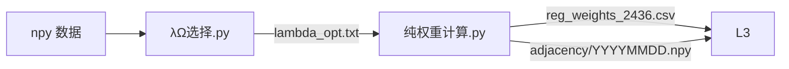

# 图形Lasso 构造层规范

> 本规范仅覆盖阶段一（λ选择）与阶段二（纯权重计算），即论文 §3.1 GLasso 精度矩阵估计 → GMVP 权重的完整实现。

---

## 一、架构红线

### 1.1 开发前必读 README
先读取 `图形Lasso/README.md` §1-4，了解架构、参数与边界。**不得凭记忆编码。**

### 1.2 参数唯一源
```
所有参数: 图形Lasso/code/共享模块.py
引用方式: from 共享模块 import K, EPS_RIDGE, ...
禁止: 脚本内硬编码魔数
```

### 1.3 数据流单向

- 阶段间仅通过 `.txt / .csv / .npy` 通信，不跨阶段 import
- `共享模块.py` 不 import 项目内其他脚本

### 1.4 GLasso 唯一入口
```python
from 共享模块 import do_glasso  # ✅
from sklearn.covariance import graphical_lasso  # ❌ 禁止
```
- 协方差公式：`Σ̂ = X @ Xᵀ + ridge·I`，**不除以 M**（论文公式3）
- 唯一例外：`纯权重计算.py` 的 `work()` 函数因多进程隔离需要，直接调用 sklearn
- Ridge 退避链：`[1e-4, 1e-3, 1e-2]`

---

## 二、参数体系

| 参数 | 值 | 状态 | 说明 |
|------|:--:|:--:|------|
| K | 392 | ✅ 已确定 | 资产池规模 |
| λ | **3e-6** | ✅ 已确定 | 密度 62%，OOS 方差仅 +5.6% |
| MAX_ITER | 150 | ✅ 已确定 | GLasso 坐标下降迭代上限 |
| EPS_RIDGE | 1e-4 | ✅ 已确定 | 初始 Ridge 扰动量 |
| TOL_GLASSO | 1e-4 | ✅ 已确定 | 收敛容差 |
| RIDGE_FALLBACK | [5e-4, 1e-3, 5e-3, 1e-2] | ✅ 已确定 | 共享模块内部退避链 |
| L_TRAIN_GLASSO | 40 | ✅ 已确定 | 训练窗天数 |

> λ 选择依据：原始 λ=5e-7 密度 94%（全连接）→ 5 天采样扫描 → λ=3e-6 密度 64%（度 244, σ=52，网络特征有区分度）

---

## 三、阶段一：λ 选择

**输入**：`.npy` 日内收益（392 资产 × 390 分钟）  
**方法**：固定时间窗（44 训练 + 5 验证 + 22 测试），最小化验证集组合方差  
**扫描范围**：1e-7 ~ 1e-5，等对数间隔步长  
**输出**：`lambda_opt.txt`（单行浮点数）  
**运行**：`python 图形Lasso/code/λΩ选择.py`

### 要求
- 候选 λ 至少 8 个，覆盖 1e-7 ~ 1e-5 量级
- 每个 λ 验证集至少 5 天有效
- 最优 λ 同时满足：OOS 方差最低 / 网络密度 ≤ 80%
- 若密度 > 80%，沿 λ 递增方向寻找下一个方差可接受的 λ
- 当前 λ=3e-6 已锁定，非必要不重新扫描

---

## 四、阶段二：纯权重计算

**输入**：`lambda_opt.txt` + 2436 天 `.npy` 日内收益  
**方法**：逐日 GLasso（公式 3→4→5），`Pool.imap_unordered` 11 核并行  
**运行**：`python "图形Lasso/code/纯权重计算.py"`（~3h）

### 4.1 核心逻辑

```python
# 每行对应论文公式
rett = load_day(t)                    # (390, 392) 日内收益
cov = rett @ rett.T                    # (3) Σ̂ = X@Xᵀ
cov.flat[::K+1] += ridge              # + Ridge·I
_, prec = graphical_lasso(cov, λ)     # (4) GLasso → Θ̂
p1 = prec @ 1                         # Θ · 1
w  = p1 / 1ᵀ·p1                      # (5) GMVP 权重
```

### 4.2 要求

| 项目 | 要求 |
|------|------|
| 并行方式 | `Pool.imap_unordered` + `freeze_support()` |
| BLAS 控制 | 5 行 env 在 `import numpy` 前设置 |
| Ridge 退避 | `[1e-4, 1e-3, 1e-2]`，失败天标记 NaN |
| 换手率计算 | 仅适用连续成功日 |
| 失败率 | ≤ 1%，集中在 COVID 崩盘期 |

### 4.3 输出

| 文件 | 用途 |
|------|------|
| `reg_weights_2436.csv` | (2425, 392) 权重矩阵，阶段三唯一入口 |
| `adjacency/YYYYMMDD.npy` | (K,K) int8 二值邻接矩阵，2425 天 |
| `Daily_Statistics.csv` | 逐日 RPV/网络密度/非零边数/换手率 |
| `Table1_Descriptive_Statistics.csv` | 论文 §5.1 描述性统计 |
| `failed_days.csv` | COVID 崩盘 11 天明细 |

---

## 五、反直觉规则

| 你以为 | 实际 |
|--------|------|
| 协方差 = X@Xᵀ / M | **不除 M**，直接 X@Xᵀ |
| K=392 > M=390 → 满秩 | **必定奇异**，Ridge 不可省略 |
| GLasso 迭代 500+ | 30~80 次收敛，150 足够 |
| `cond_val` 每天算 | 每 40 天算一次，仅用于参考 |
| BLAS 自动多线程 | Windows 下 11×24=264 线程抢核，必须手动设 1 |

---

## 六、已知坑点

| # | 一句话 | 解决 |
|:--:|--------|------|
| 1 | float32 传 GLasso → FloatingPointError | 全程 float64 |
| 2 | λ > 1e-3 → 权重 = 1/K（等权重） | λ ≤ 1e-5 |
| 3 | 崩盘日协方差死锁 | Ridge 退避链 |
| 4 | pyreadr 多进程枪文件 | 转 .npy |
| 5 | 中文路径 spawn 找不到模块 | 首行 `stdout.reconfigure('utf-8')` |
| 6 | 没 `freeze_support()` → RuntimeError | `if __name__ == '__main__': main()` |
| 7 | 输出目录没建 → 写入失败 | `OUT_DIR.mkdir(parents=True, exist_ok=True)` |
| 8 | CMD `cd` 不跨盘 → git 找不到 | `cd /d` 或先 `d:` |
| 9 | 旧 log 被覆盖 | 手存关键行 |
| 10 | 无交易日全零列 | Ridge 自动覆盖 |
| 11 | `ProcessPoolExecutor` 卡死 | 改 `Pool.imap_unordered` |
| 12 | 云端竞价限速 | 减少 worker / 本地跑 |
| **13** | **BLAS 264 线程抢 8 核 → 63h** | **import numpy 前加 5 行 env** |

---

## 七、命令速查

```bash
cd /d "d:\HuaweiMoveData\Users\27438\Desktop\大创"

# 阶段一：选 λ（已做，λ=3e-6，非必要不重跑）
python 图形Lasso/code/λΩ选择.py

# 阶段二：全量权重（~3h）
python "图形Lasso/code/纯权重计算.py"
```

---

*最后更新: 2026-06-26*
